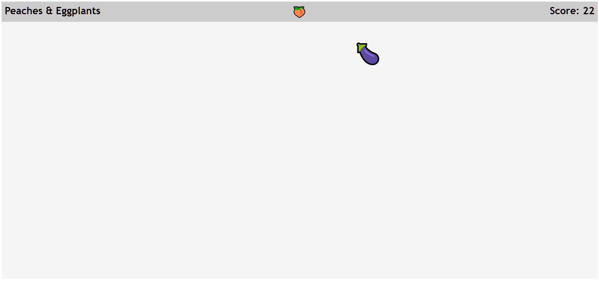

# Peaches and Eggplants
Peaches and Eggplants is a quick incremental game that I put together as a challenge to make a completed game in under three hours while I was on my most recent flight from Charlotte to Phoenix. I've recently found that working on small, non-day job projects while I fly is a soothing and low-pressure way to practice writing code, and P&E is the most recent iteration of that.

The gameplay of Peaches & Eggplants is simply to press whichever item is on the screen at the top when it shows up in the canvas. The game starts when the page loads and goes on as long as you want it to. 

The speed correlates to the number of points that you've scored. The number of different emojis that are available are unlocked by hitting exact point values. 

## Design & Implementation
I wanted this to be in a playable state within three hours, and it had to work completely offline. The only help I got was from the files on my local machine and the kindness of my seatmates to help me out. Shout out to [VS Code](https://code.com) for having some pretty great autocomplete features built-in. Before I started coding, I sketched out a little design document on a notepad that let me choose what I wanted my gameplay to be like. I wound up with this style of game because I figured it would be enough to get me going without needing to add too much complex logic.

## A few gotchas
If you're just starting out with programming or JavaScript, I've outlined a couple of tricks and easy 'gotchas' that can happen with JS development: 

* I'm using the `style: margin` tags to move my active button around the page. It's calculated with the function `createNewPosition()` in `script.js`

* When you're setting and removing intervals using `window.setInterval`, make sure that you store a reference to the interval with a named variable. That variable is what you'll pass to the `window.clearInterval` function, which I do when changing the top icon and the main button in order to keep the intervals from interfering with one another when I changed speeds or icons.

* Emojis are a great shortcut for 2D sprite art if you're doing a quick game jam in the browser. I've been using this as a way to prototype tools and play with various "coding-for-fun" projects, and it's been a blast. If you're coding on Windows, you can use the Windows key and '.' to open up an emoji keyboard! 

* When you're connecting functions from your HTML elements to your script functions, don't forget to include the closing `()` in the string. 

## Why make something like this?
I'm a software engineer by day working on virtual reality applications, and I use these mini projects to keep me feeling productive and get more ideas floating around. A few months ago, I made a peaceful little rainbow line drawing browser app using [Glitch](glitch.com) and it gave me a new appreciation for creative coding that didn't have a deadline. In addition to just helping me pass time on airplanes, working without constraints helps build more positive feelings about all kinds of coding, and helps me cultivate a sense of appreciation and satisfaction from the work itself rather than external validation or customer needs. Intrinsic motivation doesn't come naturally to me, so working this way helps me hone my own sense of pride in creating small pockets of personal delight. It also allows me to break out of pure 3D thinking and routine ways of doing things, which helps to solidify the concepts I get tangled up in on a day to day basis and trust my own abilities more. 